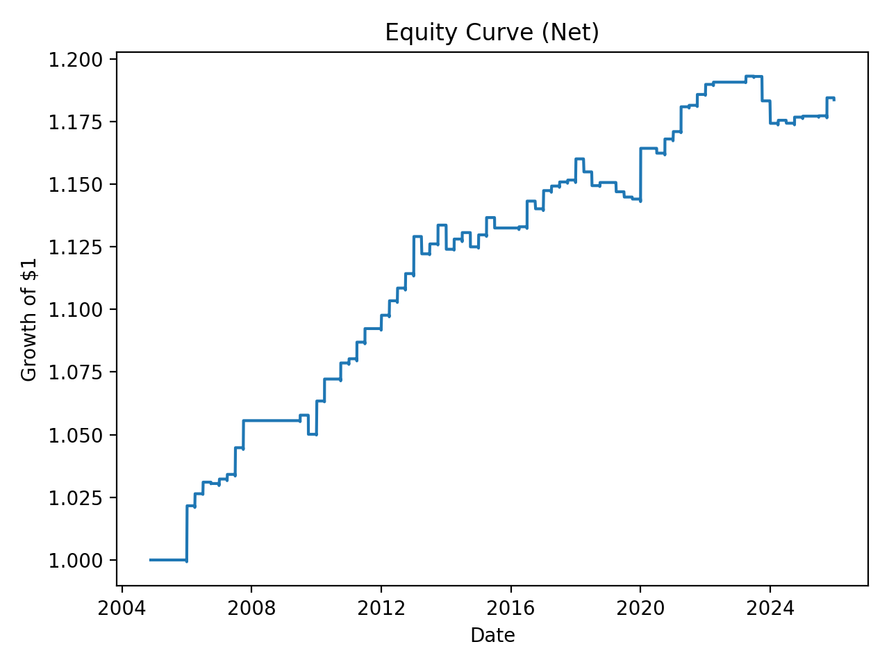
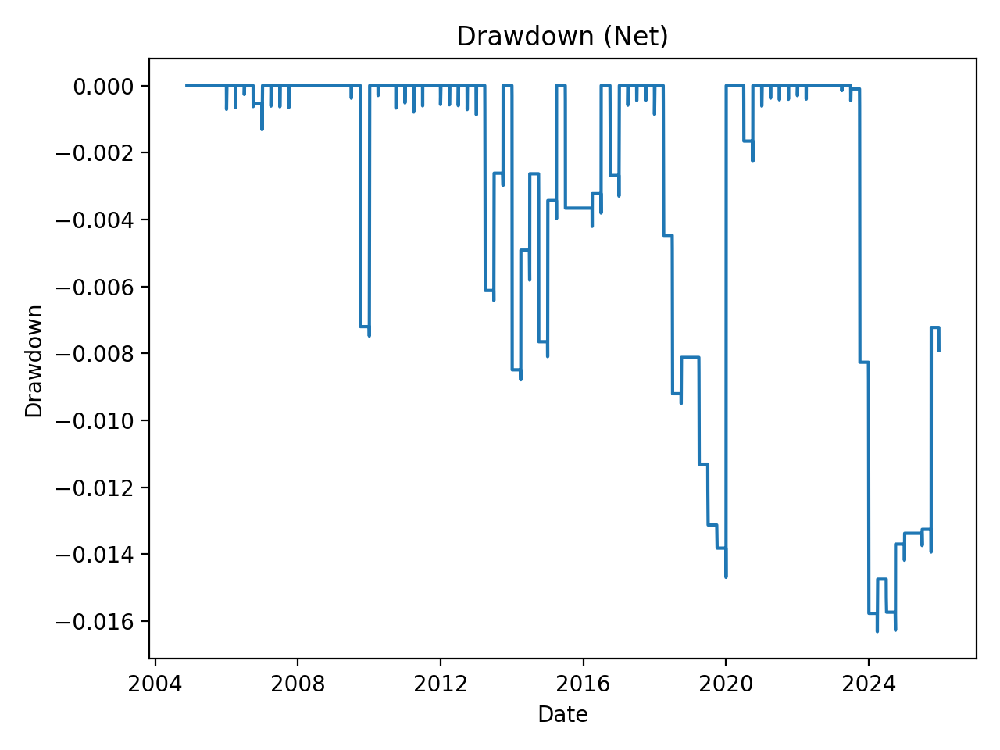

# 📈 Time-Series Momentum with Risk Regime Filter

A systematic, cross-asset trend-following strategy implemented in Python.  
This project emphasizes **risk-aware portfolio construction**, disciplined experimentation, and realistic backtesting assumptions.

---

## 🔍 Overview

This repository contains a research-grade implementation of a **time-series momentum strategy** applied across liquid ETFs. The strategy combines:

- Medium-term trend signals  
- Volatility targeting  
- Position constraints  
- A simple risk-on / risk-off regime filter  

The objective is **not** to maximize raw returns, but to study how **risk controls and regime awareness** affect real-world performance.

---

## 💡 Strategy Summary

### Asset Universe
- **SPY** — US equities  
- **EFA** — Developed ex-US equities  
- **EEM** — Emerging markets  
- **TLT** — Long-duration US Treasuries  
- **IEF** — Intermediate Treasuries  
- **GLD** — Gold  

This universe provides cross-asset diversification and long historical data availability.

---

### Signal
- **12-month time-series momentum**
- Long if trailing 12-month return > 0  
- Long / flat only (cash allowed)

---

### Risk Regime Filter
- **Risk-on:** SPY price above its 200-day moving average  
- **Risk-off:** SPY price below its 200-day moving average  

When the filter is risk-off, all positions are closed and the portfolio holds cash.

---

### Portfolio Construction
- **Rebalancing frequency:** Quarterly  
- **Position sizing:** Inverse volatility weighting  
- **Volatility target:** 10% annualized portfolio volatility  
- **Position limits:** Maximum 30% per asset (applied after volatility scaling)  
- **Residual cash:** Held when constraints bind  

---

### Transaction Costs
- **5 basis points** per unit of turnover  

---

## 📊 Performance (Net of Costs)

| Metric | Value |
|------|------|
| Annualized Return | ~0.8% |
| Annualized Volatility | ~1.1% |
| Sharpe Ratio | ~0.70 |
| Maximum Drawdown | ~−1.6% |
| Annual Turnover | ~5% |

> The strategy prioritizes capital preservation and stability over return maximization.

## 📉 Results Plots





---

## 🧪 Research Process

This project was developed using a controlled, iterative research approach:

1. Baseline 12-month momentum strategy  
2. Signal variants tested (12–1 momentum, 6M + 12M momentum)  
3. Rebalancing frequency comparison (monthly vs quarterly)  
4. Identification and correction of position-sizing constraints  
5. Addition of a risk-on / risk-off regime filter  

Only changes that improved **risk-adjusted performance** were retained.

---

## 📄 Research Memo

A concise research memo detailing the hypothesis, methodology, results, and limitations is available here:

➡️ **[`strategy_memo.md`](strategy_memo.md)**

---

## 🚀 How to Run

```bash
pip install -r requirements.txt
python backtest.py

